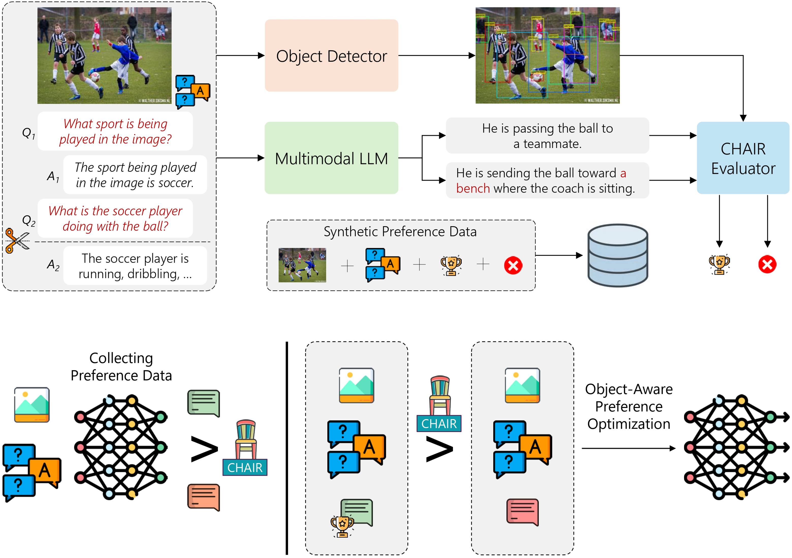

# Mitigating Hallucinations in Multimodal LLMs via Object-aware Preference Optimization [BMVC 2025]

<p align="center">
<a href="https://www.arxiv.org/abs/2508.20181"></a>
<a href="https://huggingface.co/collections/aimagelab/chair-dpo"></a>
</div>

<p align="center">
  
</p>

This repository contains the reference code for the paper [Mitigating Hallucinations in Multimodal LLMs via Object-aware Preference Optimization](https://www.arxiv.org/abs/2508.20181), **BMVC 2025**.

Please cite with the following BibTeX:
```bibtex
@inproceedings{compagnoni2025mitigating,
  title={{Mitigating Hallucinations in Multimodal LLMs via Object-aware Preference Optimization}},
  author={Compagnoni, Alberto and Caffagni, Davide and Moratelli, Nicholas and Cornia, Marcella and Baraldi, Lorenzo and Cucchiara, Rita},
  booktitle={Proceedings of the British Machine Vision Conference},
  year={2025}
}
```

## 📢 Latest Updates
- **[2025/11/29]** 📊 Released preference datasets and object detection annotations, available at the [CHAIR-DPO collection](https://huggingface.co/collections/aimagelab/chair-dpo)
- **[2025/11/23]** 🚀 CHAIR-DPO fine-tuned models now available for download on [HuggingFace Hub](https://huggingface.co/collections/aimagelab/chair-dpo)

## Abstract
Multimodal Large Language Models (MLLMs) emerge as a unified interface to address a multitude of tasks, ranging from NLP to computer vision. Despite showcasing state-of-the-art results in many benchmarks, a long-standing issue is the tendency of MLLMs to hallucinate, that is to generate answers to the user's query that are not reflected in the visual input. In this paper, we address the problem of hallucinations as an alignment problem, seeking to steer the MLLM so that it prefers generating content without hallucinations. In contrast to recent approaches that require complicated pipelines to build synthetic preference data for alignment training, often relying on proprietary models, we capitalize on the well-known CHAIR metric, originally proposed to gauge the degree of hallucinations in image captioning. Given a pair of generated answers, we leverage CHAIR to distinguish winner and loser options (i.e., non-hallucinated and hallucinated samples) and fine-tune off-the-shelf MLLMs via Direct Preference Optimization (DPO). The resulting method, which we refer to as CHAIR-DPO, effectively diminishes the amount of hallucinated answers on several hallucination benchmarks, demonstrating the effectiveness of fine-tuning the MLLM with a CHAIR-based reward.

## Installation
```bash
# Create the base environment
conda create -y -c conda-forge -n dpoenv --override-channels python=3.10
conda activate dpoenv
pip install torch==2.3.0 torchvision==0.18.0 --index-url https://download.pytorch.org/whl/cu118
pip install -r requirements_chairdpo_train.txt

# Download `llava` package from https://github.com/aimagelab/LLaVA-MORE
git clone https://github.com/aimagelab/LLaVA-MORE.git
cd LLaVA-MORE
git checkout ffadce8a32eb39879b5967d4dc392a02d2585e8c
cp -r llava path/to/CHAIR-DPO

# Download models weights
huggingface-cli download "liuhaotian/llava-v1.5-7b"
huggingface-cli download "openai/clip-vit-large-patch14-336"
huggingface-cli download "aimagelab/LLaVA_MORE-llama_3_1-8B-finetuning"
```

## Training
Edit the following scripts with the correct checkpoints and data paths:

**CHAIR-DPO fine-tuning (LLaVA 1.5 7B)**
```
./scripts/dpo/train_multinode_llava.sh
```
**CHAIR-DPO fine-tuning (LLaVA-MORE 8B)**
```
./scripts/dpo/train_multinode_llava_more.sh
```

## Acknowledgements
We acknowledge the use of the following open-source codebases: [LLaVA](github.com/haotian-liu/LLaVA), [LLaVA-MORE](https://github.com/aimagelab/LLaVA-MORE), [DiCO](https://github.com/aimagelab/DiCO) and [CHAIR-metric-standalone](https://github.com/Maxlinn/CHAIR-metric-standalone).


